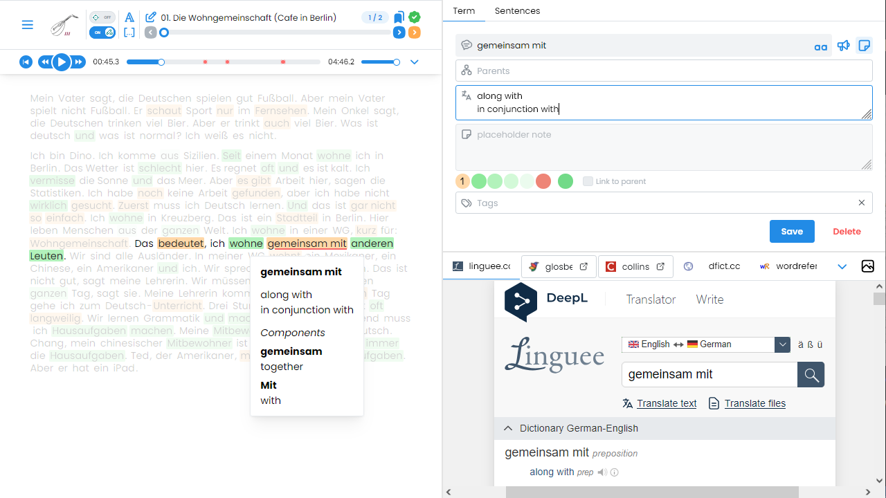

<h1 align="center">
  
  Lute 3 React Frontend
</h1>

[Lute](https://github.com/LuteOrg/lute-v3) (Learning Using Texts) is a web application for learning languages by reading texts. The core application is written in Python/Flask.
This repo adds React frontend which works with backend's API endpoints.

 

Demo: https://lute-v3-frontend.onrender.com _(might need up to a minute for the server to spin up)_

## Built With


## Installation

Installation will be in two parts. First we install the backend with API endpoints and then this frontend app.

### Backend

Use the `api` branch from the below repo. See installation instructions [here](https://github.com/LuteOrg/lute-v3/wiki/Development).

```
https://github.com/oashrafov/lute-v3/tree/api
```

Install backend and launch it.

### Frontend

Clone this repo.

```sh
git clone https://github.com/oashrafov/lute-v3-frontend.git
```

`cd` into `lute-v3-frontend` and install packages.

```sh
npm install
```

Create an `.env` file in the root folder and fill in the backend url.

```js
VITE_BACKEND_URL=
```

_Note: This is the url that core Lute runs at. Default is `http://localhost:5001`_

Build the app.

```sh
npm run build
```

Launch the server.

```sh
npm run preview
```

Your app should be live at http://localhost:4173
